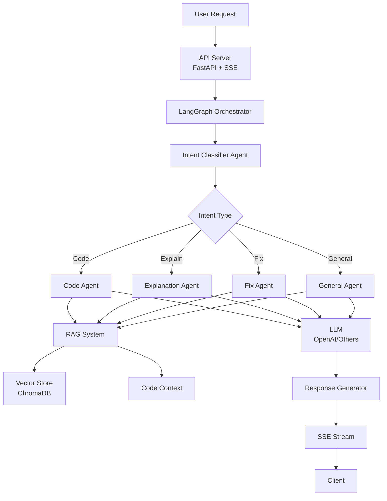

# AgentSmithy Local Server

A local AI server similar to Cursor, built using LangGraph for agent orchestration, RAG for contextualization, and SSE streaming support.

## Features

- 🤖 **Multi-agent system** using LangGraph
- 📚 **RAG (Retrieval-Augmented Generation)** for context handling
- 🔄 **Streaming responses** via Server-Sent Events (SSE)
- 🎯 **Specialized agents** for different tasks:
  - **Code Agent** - code generation
  - **Refactor Agent** - code refactoring
  - **Explain Agent** - code and concept explanations
  - **Fix Agent** - bug fixing
- 🔌 **Flexible architecture** for connecting different LLMs (starting with OpenAI)
- 🗄️ **Vector database** ChromaDB for context storage

## Architecture



## Installation

1. Clone the repository:
```bash
git clone https://github.com/yourusername/agentsmithy-local.git
cd agentsmithy-local
```

2. Create a virtual environment:
```bash
python -m venv venv
source venv/bin/activate  # On Windows: venv\Scripts\activate
```

3. Install dependencies:
```bash
pip install -r requirements.txt
```

4. Create `.env` file from example:
```bash
cp .env.example .env
```

5. Add your OpenAI API key to `.env`:
```env
OPENAI_API_KEY=your_openai_api_key_here
```

## Usage

### Starting the Server

```bash
# Option 1: Using main.py (recommended)
python main.py

# Option 2: Using uvicorn directly
uvicorn agentsmithy_server.api.server:app --reload --host localhost --port 11434
```

The server will be available at: `http://localhost:11434`

### Testing the API

#### Streaming request (SSE):
```bash
curl -X POST http://localhost:11434/api/chat \
     -H "Content-Type: application/json" \
     -d '{
       "messages": [
         {"role": "user", "content": "Help me refactor this code"}
       ],
       "context": {
         "current_file": {
           "path": "example.py",
           "language": "python",
           "content": "def calculate(x, y): return x + y"
         }
       },
       "stream": true
     }'
```

#### Regular request:
```bash
curl -X POST http://localhost:11434/api/chat \
     -H "Content-Type: application/json" \
     -d '{
       "messages": [
         {"role": "user", "content": "Explain this function"}
       ],
       "stream": false
     }'
```

## API Endpoints

### POST /api/chat
Main chat endpoint.

**Request:**
```json
{
  "messages": [
    {"role": "user", "content": "Your question here"}
  ],
  "context": {
    "current_file": {
      "path": "file.py",
      "language": "python",
      "content": "file content",
      "selection": "selected code"
    },
    "open_files": [
      {
        "path": "other_file.py",
        "language": "python",
        "content": "content"
      }
    ]
  },
  "stream": true
}
```

**Response (streaming):**
```
data: {"type": "classification", "task_type": "refactor"}

data: {"content": "I'll help you refactor "}

data: {"content": "this code..."}

data: {"done": true}
```

### GET /health
Server health check.

## Extending Functionality

### Adding a New LLM Provider

1. Create a new provider class in `agentsmithy_server/core/llm_provider.py`:
```python
class YourLLMProvider(LLMProvider):
    async def agenerate(self, messages, stream=False):
        # Your implementation
        pass
```

2. Register the provider:
```python
LLMFactory.register_provider("your_llm", YourLLMProvider)
```

### Adding a New Agent

1. Create a new agent class in `agentsmithy_server/agents/`:
```python
from agentsmithy_server.agents.base_agent import BaseAgent

class YourAgent(BaseAgent):
    def get_default_system_prompt(self) -> str:
        return "Your agent prompt"
    
    def get_agent_name(self) -> str:
        return "your_agent"
```

2. Add the agent to the orchestrator in `agentsmithy_server/core/agent_graph.py`

## Project Structure

```
agentsmithy-local/
├── agentsmithy_server/
│   ├── agents/              # Specialized agents
│   ├── api/                 # FastAPI server
│   ├── config/              # Configuration
│   ├── core/                # Core components (LLM, LangGraph)
│   ├── rag/                 # RAG system
│   └── utils/               # Utilities
├── requirements.txt         # Dependencies
├── .env.example            # Configuration example
└── README.md               # Documentation
```

## Debugging and Diagnostics

The server includes structured logging for debugging issues. All logs are output in JSON format for easy parsing.

### Enable Debug Logging

Add to your `.env` file:
```env
LOG_LEVEL=DEBUG
```

### Switch to JSON Logging

By default, the server uses pretty colored logs for development. To switch to JSON format (for production or log parsing):

```bash
# Option 1: Environment variable
LOG_FORMAT=json python main.py

# Option 2: Add to .env file
LOG_FORMAT=json
```

### Log Output Example

When debug logging is enabled, you'll see detailed information about:
- Request processing flow
- Agent classification and routing
- SSE event generation
- Response streaming
- Error details with stack traces

Example log output:
```json
{"timestamp": "2024-01-01T12:00:00", "level": "INFO", "logger": "agentsmithy.api", "message": "Chat request received", "client": "127.0.0.1", "streaming": true}
{"timestamp": "2024-01-01T12:00:01", "level": "DEBUG", "logger": "agentsmithy.agents", "message": "Classifying task", "query_preview": "Help me refactor this code"}
{"timestamp": "2024-01-01T12:00:02", "level": "INFO", "logger": "agentsmithy.agents", "message": "Task classified", "task_type": "refactor"}
```

### Common Issues

1. **No response in client**: Check logs for SSE event generation. Look for `"SSE Event"` entries.
2. **Classification errors**: Debug logs show which agent is selected and why.
3. **Streaming issues**: Look for `"content_chunk"` events in the logs.

## License

MIT License

## Contributing

Pull requests are welcome. For major changes, please open an issue first to discuss what you would like to change. 