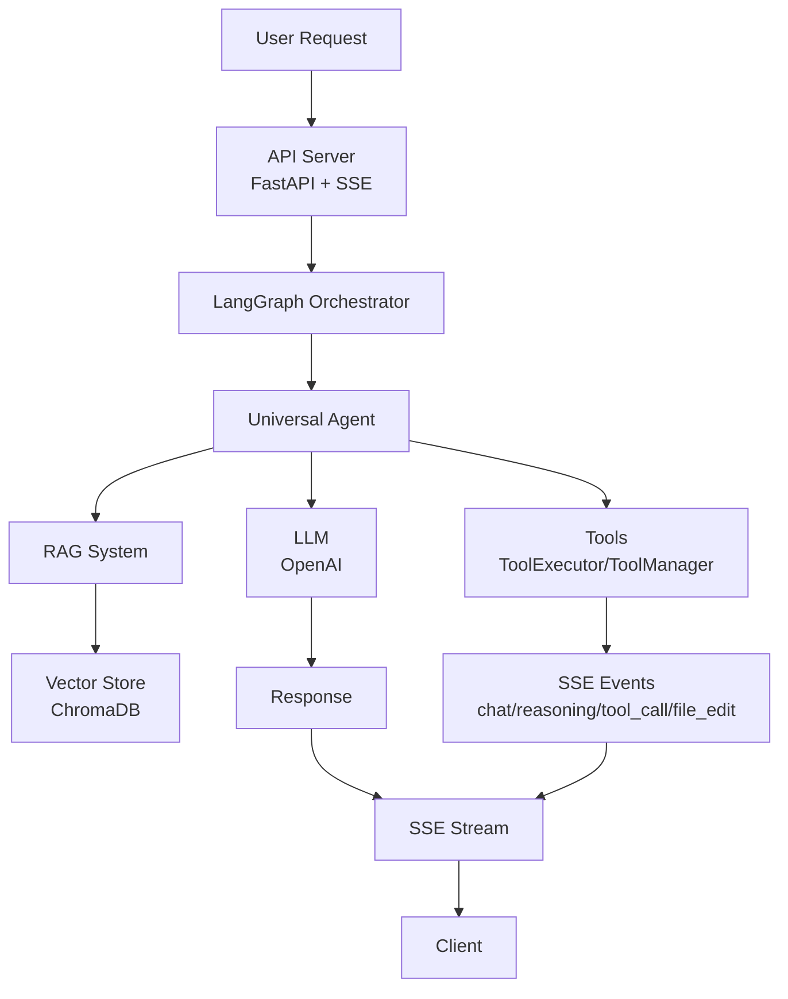

# AgentSmithy - AI Coding Assistant Server

[](https://github.com/AgentSmithyAI/agentsmithy-agent/releases)
[](LICENSE)
[](https://github.com/AgentSmithyAI/agentsmithy-agent/actions/workflows/workflow.yaml)
[](https://codecov.io/gh/AgentSmithyAI/agentsmithy-agent)
[](https://www.python.org/)

A self-hosted AI coding assistant server that integrates with your IDE. Built with LangGraph orchestration, RAG-powered context understanding, and real-time SSE streaming. Provides code assistance through a comprehensive set of tools and supports multiple LLM providers.

## Documentation

- See the documentation in [docs/](./docs).
- SSE protocol details (current): [docs/sse-protocol.md](./docs/sse-protocol.md)

## Formatting, Linting & Tests

- Black format check: `black --check .`
- Black autofix: `black .`
- isort check: `isort --check-only .`
- isort autofix: `isort .`
- Ruff linting: `ruff check .`
- Type checking (MyPy): `mypy agentsmithy_server`
- Unit tests (pytest):
  - Run once: `pytest -v`
  - With coverage: `pytest --cov=agentsmithy_server --cov-report=term-missing`

Or use Makefile shortcuts:
- `make format` - Run black and isort
- `make lint` - Run ruff
- `make typecheck` - Run mypy
- `make test` - Run pytest

## Features

- 🤖 **Universal AI Agent** - Intelligent coding assistant powered by LangGraph orchestration
- 📚 **RAG-Powered Context** - ChromaDB-based vector store for semantic code understanding and retrieval
- 🔄 **Real-time Streaming** - Server-Sent Events (SSE) for immediate response feedback
- 🧰 **Comprehensive Tools** - File operations, code search, project inspection, and more
- 🔌 **Multi-Provider Support** - Extensible LLM provider system (OpenAI with GPT-5 support included)
- 💬 **Conversation Persistence** - Dialog management with full history and resumable conversations
- 🎯 **IDE Integration** - Context-aware assistance tailored to your development environment

## Architecture



## What is AgentSmithy?

AgentSmithy is a self-hosted AI coding assistant server that brings powerful language model capabilities to your development workflow. It runs as a standalone local server and connects to your IDE through plugins, allowing you to use it with any editor or IDE of your choice.

**Architecture:**
- **Server-based**: AgentSmithy runs as a separate process, not embedded directly in your IDE
- **Plugin Integration**: Connect through lightweight IDE plugins (e.g., [VSCode extension prototype](https://github.com/AgentSmithyAI/agentsmithy-vscode))
- **IDE Agnostic**: Works with any IDE that has a developed plugin system - VSCode, JetBrains, Vim, Emacs, etc.

**Key Capabilities:**
- **Code Understanding**: Analyzes your codebase using RAG to provide contextually relevant suggestions
- **Code Generation**: Creates new code, refactors existing code, and implements features based on your requirements
- **Code Explanation**: Explains complex code segments and provides documentation
- **Project Navigation**: Helps you understand project structure and find relevant code
- **Tool Execution**: Performs file operations, runs commands, and interacts with your development environment

## Installation

1. Clone the repository:
```bash
git clone https://github.com/AgentSmithyAI/agentsmithy-agent.git
cd agentsmithy-agent
```

2. Create a virtual environment (option A: Makefile-managed):
```bash
make install         # creates .venv and installs requirements
make install-dev     # optional: adds dev tooling (ruff, black, mypy, pytest)
```

Or create it manually (option B):
```bash
python -m venv venv
source venv/bin/activate  # On Windows: venv\Scripts\activate
```

3. Install dependencies (skip if you used `make install`):
```bash
pip install -r requirements.txt
```

4. Create a `.env` file with required model and API key (minimum):
```env
OPENAI_API_KEY=your_openai_api_key_here
DEFAULT_MODEL=gpt-5  # required

# Optional overrides
# DEFAULT_TEMPERATURE=0.7
# DEFAULT_EMBEDDING_MODEL=text-embedding-3-small
# MAX_TOKENS=4000
# REASONING_EFFORT=medium       # only for gpt-5 models
# REASONING_VERBOSITY=auto      # only for gpt-5 models
# SERVER_HOST=localhost
# SERVER_PORT=8765              # base port; actual port may auto-increment
# LOG_FORMAT=pretty             # or json
# SERVER_RELOAD=false           # enable hot-reload in dev with true
```

## Usage

### Starting the Server

```bash
# Basic usage
python main.py --workdir /abs/path/to/workspace

# With IDE specification (recommended for better context)
python main.py --workdir /abs/path/to/workspace --ide vscode
python main.py --workdir /abs/path/to/workspace --ide jetbrains
python main.py --workdir /abs/path/to/workspace --ide vim
```

The server starts at base port `8765` (auto-increments if busy). Check startup logs for the actual URL, e.g., `http://localhost:8765`.

Notes:
- `--workdir` should point to the project directory you want to work with. The server stores state in `<workdir>/.agentsmithy`.
- If a server is already running for the same project, startup will abort with a helpful message.

### Startup Parameters

- `--workdir` (required): absolute path to the project directory. On startup, the server ensures `/abs/path/to/workspace/.agentsmithy` exists. Project-specific data (e.g., RAG index, dialogs, status.json) is stored under each project's `.agentsmithy` directory. The server keeps this path in-process; no env var is used.

- `--ide` (optional): IDE identifier to provide better context to the AI agent. Common values: `vscode`, `jetbrains`, `vim`, `emacs`, `sublime`, `neovim`. If not specified, the agent will see "unknown IDE". This parameter is runtime-only and not saved to configuration. The agent receives environment information (OS, shell, IDE) in its system prompt, allowing it to provide IDE-specific advice and use appropriate commands for your platform.

### Projects and RAG Storage

- Workspace root state: `<workdir>/.agentsmithy`
- Per-project state: `<workdir>/.agentsmithy`
- RAG (ChromaDB) persistence per project: `<workdir>/.agentsmithy/rag/chroma_db`

### Testing the API

#### Streaming request (SSE):
```bash
curl -X POST http://localhost:8765/api/chat \
     -H "Content-Type: application/json" \
     -H "Accept: text/event-stream" \
     -d '{
       "messages": [
         {"role": "user", "content": "Help me refactor this code"}
       ],
       "context": {
         "current_file": {
           "path": "example.py",
           "language": "python",
           "content": "def calculate(x, y): return x + y"
         }
       },
       "stream": true
     }'
```

#### Regular request:
```bash
curl -X POST http://localhost:8765/api/chat \
     -H "Content-Type: application/json" \
     -d '{
       "messages": [
         {"role": "user", "content": "Explain this function"}
       ],
       "stream": false
     }'
```

#### Browser/Node streaming client example
The endpoint is `POST /api/chat` (SSE over POST). Use `fetch` with a streaming reader:

```javascript
// Browser example
const res = await fetch('http://localhost:8765/api/chat', {
  method: 'POST',
  headers: {
    'Content-Type': 'application/json',
    'Accept': 'text/event-stream',
  },
  body: JSON.stringify({
    messages: [{ role: 'user', content: 'Help me refactor this code' }],
    stream: true,
  }),
});

const reader = res.body.getReader();
const decoder = new TextDecoder();
let buffer = '';
while (true) {
  const { value, done } = await reader.read();
  if (done) break;
  buffer += decoder.decode(value, { stream: true });
  for (const chunk of buffer.split('\n\n')) {
    if (!chunk.trim()) continue;
    if (!chunk.startsWith('data: ')) continue;
    const json = JSON.parse(chunk.slice(6));
    // handle events by json.type
  }
  buffer = '';
}
```

## API Endpoints

### POST /api/chat
Main chat endpoint (supports SSE when `Accept: text/event-stream` and `stream: true`).

**Request:**
```json
{
  "messages": [
    {"role": "user", "content": "Your question here"}
  ],
  "context": {
    "current_file": {
      "path": "file.py",
      "language": "python",
      "content": "file content",
      "selection": "selected code"
    },
    "open_files": [
      {
        "path": "other_file.py",
        "language": "python",
        "content": "content"
      }
    ]
  },
  "stream": true
}
```

**Response (streaming):**
```
data: {"type": "chat_start", "dialog_id": "01J..."}

data: {"type": "chat", "content": "I'll help you refactor ", "dialog_id": "01J..."}

data: {"type": "tool_call", "name": "read_file", "args": {"path": "example.py"}, "dialog_id": "01J..."}

data: {"type": "file_edit", "file": "/abs/path/to/example.py", "dialog_id": "01J..."}

data: {"type": "chat_end", "dialog_id": "01J..."}

data: {"type": "done", "done": true, "dialog_id": "01J..."}
```

### GET /
Root endpoint with API information and usage examples.

### GET /health
Server health check.

### Dialogs API
Manage per-project conversations persisted under `<workdir>/.agentsmithy/dialogs`.

**Dialog Management:**
- `GET /api/dialogs` - List all dialogs with sorting and pagination
- `POST /api/dialogs` - Create a new dialog
- `GET /api/dialogs/current` - Get current active dialog
- `PATCH /api/dialogs/current?id=<id>` - Set current active dialog
- `GET /api/dialogs/{dialog_id}` - Get dialog metadata
- `PATCH /api/dialogs/{dialog_id}` - Update dialog (e.g., change title)
- `DELETE /api/dialogs/{dialog_id}` - Delete a dialog

**Dialog History:**
- `GET /api/dialogs/{dialog_id}/history` - Get dialog history with cursor-based pagination
  - Query params: `limit` (default: 20), `before` (cursor for scrolling up)
  - Returns events in chronological order: messages, reasoning blocks, tool calls, file edits

**Tool Results:**
- `GET /api/dialogs/{dialog_id}/tool-results` - List all tool results metadata for a dialog
- `GET /api/dialogs/{dialog_id}/tool-results/{tool_call_id}` - Get full tool execution result

## Binary Distribution

AgentSmithy can be built as a standalone binary using PyInstaller, eliminating the need for Python runtime on target systems.

### Building Binary

```bash
# Build binary with all checks (format, lint, test, package)
make build

# Or build binary only (skip checks)
make pyinstall
```

The binary will be created at `dist/agentsmithy`.

### Binary Features

- **Single executable**: No Python installation required
- **UPX compression**: Automatically enabled if `upx` is installed (reduces binary size)
- **Bundled dependencies**: All dependencies (ChromaDB, LangChain, etc.) included
- **Cross-platform**: Build on your target OS (Linux, macOS, Windows)

### Running Binary

```bash
# Same usage as Python version
agentsmithy --workdir /path/to/project --ide vscode
```

**Note**: The binary includes all dependencies but still requires network access for LLM API calls and will create `.agentsmithy` directories in your project workspaces.

## Development

### Tooling

- Linters/formatters: Ruff + Black + isort
- Type checking: mypy
- Tests: pytest

### Setup (recommended)

```bash
# create .venv and install runtime deps
make install

# install dev tools (ruff, black, mypy, pytest)
make install-dev
```

### Common tasks

```bash
# format code
make format

# run linters
make lint

# type check
make typecheck

# run tests
make test
```

## Debugging and Diagnostics

The server includes structured logging. Pretty colored logs are used by default; set `LOG_FORMAT=json` to switch to JSON.

```bash
# Via environment variable
LOG_FORMAT=json python main.py

# Or in .env
LOG_FORMAT=json
```

### Log Output Example

When debug logging is enabled, you'll see detailed information about:
- Request processing flow
- Agent classification and routing
- SSE event generation
- Response streaming
- Error details with stack traces

Example log output:
```json
{"timestamp": "2024-01-01T12:00:00", "level": "INFO", "logger": "agentsmithy.api", "message": "Chat request received", "client": "127.0.0.1", "streaming": true}
{"timestamp": "2024-01-01T12:00:01", "level": "DEBUG", "logger": "agentsmithy.agents", "message": "Classifying task", "query_preview": "Help me refactor this code"}
{"timestamp": "2024-01-01T12:00:02", "level": "INFO", "logger": "agentsmithy.agents", "message": "Task classified", "task_type": "refactor"}
```

## License

This project is licensed under the Apache License 2.0 - see the [LICENSE](LICENSE) file for details.

Copyright 2025 Alexander Morozov
