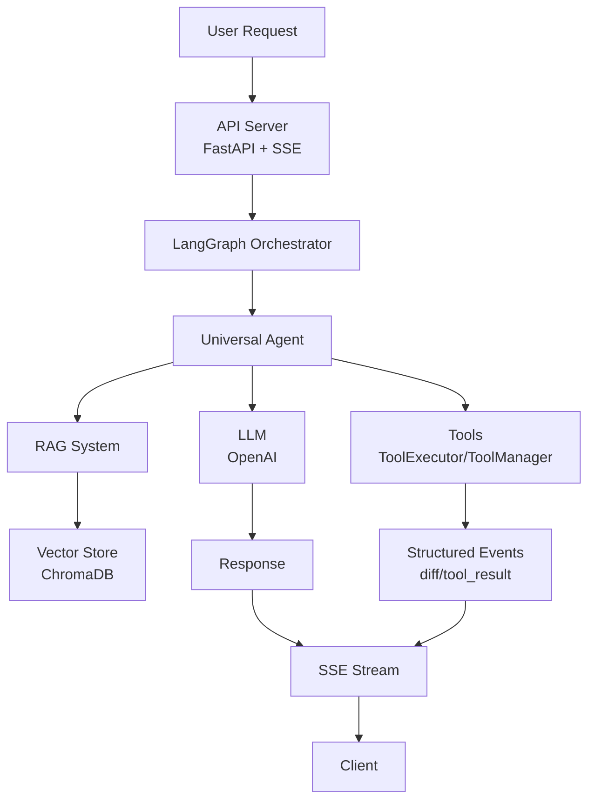

# AgentSmithy Local Server

A local AI server similar to Cursor, built using LangGraph for orchestration, RAG for contextualization, and SSE streaming.

## Documentation

- See the documentation in [docs/](./docs).
- SSE protocol details: [docs/sse-protocol.md](./docs/sse-protocol.md)

## Features

- 🤖 **Universal agent** orchestrated with LangGraph
- 📚 **RAG (Retrieval-Augmented Generation)** for context handling
- 🔄 **Streaming responses** via Server-Sent Events (SSE)
- 🧰 **Tool-aware workflow** with structured edit/diff events for code changes
- 🔌 **Flexible LLM provider interface** (OpenAI supported out of the box)
- 🗄️ **ChromaDB** vector store for context persistence

## Architecture



## Installation

1. Clone the repository:
```bash
git clone <repo-url>
cd agentsmithy-local
```

2. Create a virtual environment:
```bash
python -m venv venv
source venv/bin/activate  # On Windows: venv\Scripts\activate
```

3. Install dependencies:
```bash
pip install -r requirements.txt
```

4. Create a `.env` file and set your API key:
```env
OPENAI_API_KEY=your_openai_api_key_here
# Optional overrides
# SERVER_HOST=localhost
# SERVER_PORT=11434
# LOG_FORMAT=pretty  # or json
```

## Usage

### Starting the Server

```bash
# Start via main.py with a working directory (required)
python main.py --workdir /abs/path/to/workspace
```

The server will be available at: `http://localhost:11434`

### Startup Parameters

- `--workdir` (required when using `main.py`): absolute path to the workspace directory. On startup, the server will ensure a hidden directory `/abs/path/to/workspace/.agentsmithy` exists. Project-specific data (e.g., RAG index) will be stored under each project's own `.agentsmithy` directory inside the workspace.

Environment alternative for advanced setups: set `AGENTSMITHY_WORKDIR=/abs/path/to/workspace` before starting the process.

### Projects and RAG Storage

- Workspace root state: `<workdir>/.agentsmithy`
- Per-project state: `<workdir>/<project>/.agentsmithy`
- RAG (ChromaDB) persistence per project: `<workdir>/<project>/.agentsmithy/rag/chroma_db`

### Testing the API

#### Streaming request (SSE):
```bash
curl -X POST http://localhost:11434/api/chat \
     -H "Content-Type: application/json" \
     -H "Accept: text/event-stream" \
     -d '{
       "messages": [
         {"role": "user", "content": "Help me refactor this code"}
       ],
       "context": {
         "current_file": {
           "path": "example.py",
           "language": "python",
           "content": "def calculate(x, y): return x + y"
         }
       },
       "stream": true
     }'
```

#### Regular request:
```bash
curl -X POST http://localhost:11434/api/chat \
     -H "Content-Type: application/json" \
     -d '{
       "messages": [
         {"role": "user", "content": "Explain this function"}
       ],
       "stream": false
     }'
```

## API Endpoints

### POST /api/chat
Main chat endpoint.

**Request:**
```json
{
  "messages": [
    {"role": "user", "content": "Your question here"}
  ],
  "context": {
    "current_file": {
      "path": "file.py",
      "language": "python",
      "content": "file content",
      "selection": "selected code"
    },
    "open_files": [
      {
        "path": "other_file.py",
        "language": "python",
        "content": "content"
      }
    ]
  },
  "stream": true
}
```

**Response (streaming):**
```
data: {"type": "classification", "task_type": "universal"}

data: {"content": "I'll help you refactor "}

data: {"type": "diff", "file": "example.py", "diff": "...", "line_start": 1, "line_end": 2, "reason": "..."}

data: {"done": true}
```

### GET /health
Server health check.

## Development

### Tooling

- Linters/formatters: Ruff + Black
- Type checking: mypy
- Tests: pytest

### Setup (recommended)

```bash
# create venv and install runtime deps
make install

# install dev tools
make install-dev
```

### Common tasks

```bash
# format code
make format

# run linters
make lint

# type check
make typecheck

# run tests
make test

# run server
make run

```

## Extending Functionality

### Adding a New LLM Provider

1. Create a new provider class in `agentsmithy_server/core/llm_provider.py`:
```python
class YourLLMProvider(LLMProvider):
    async def agenerate(self, messages, stream=False):
        ...
    def get_model_name(self) -> str:
        ...
    def bind_tools(self, tools: List[BaseTool]):
        ...
```

2. Register the provider:
```python
LLMFactory.register_provider("your_llm", YourLLMProvider)
```

### Adding a New Agent

The orchestrator currently routes everything to a single `UniversalAgent`. To introduce specialized agents, add your agent in `agentsmithy_server/agents/` and update `agentsmithy_server/core/agent_graph.py` to add nodes and routing.

## Project Structure

```
agentsmithy-local/
├── agentsmithy_server/
│   ├── agents/              # Agent implementations (UniversalAgent)
│   ├── api/                 # FastAPI server
│   ├── config/              # Configuration (settings, logging)
│   ├── core/                # Core components (LLM, LangGraph)
│   ├── rag/                 # RAG system
│   └── utils/               # Utilities
├── requirements.txt         # Dependencies
└── README.md               # Documentation
```

## Debugging and Diagnostics

The server includes structured logging. Pretty colored logs are used by default; set `LOG_FORMAT=json` to switch to JSON.

```bash
# Via environment variable
LOG_FORMAT=json python main.py

# Or in .env
LOG_FORMAT=json
```

### Log Output Example

When debug logging is enabled, you'll see detailed information about:
- Request processing flow
- Agent classification and routing
- SSE event generation
- Response streaming
- Error details with stack traces

Example log output:
```json
{"timestamp": "2024-01-01T12:00:00", "level": "INFO", "logger": "agentsmithy.api", "message": "Chat request received", "client": "127.0.0.1", "streaming": true}
{"timestamp": "2024-01-01T12:00:01", "level": "DEBUG", "logger": "agentsmithy.agents", "message": "Classifying task", "query_preview": "Help me refactor this code"}
{"timestamp": "2024-01-01T12:00:02", "level": "INFO", "logger": "agentsmithy.agents", "message": "Task classified", "task_type": "refactor"}
```

### Common Issues

1. **No response in client**: Check logs for SSE event generation. Look for `SSE Event` entries.
2. **Streaming issues**: Look for `content_chunk` and `file_operation` events in the logs.

## License

MIT License

## Contributing

Pull requests are welcome. For major changes, please open an issue first to discuss what you would like to change. 