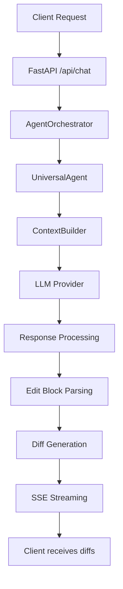

# AgentSmithy Architecture

This document describes the simplified architecture of AgentSmithy after the refactoring that eliminated multiple specialized agents.

## Overview

AgentSmithy is a code assistant server that processes user requests and generates file modifications through a single universal agent. The system is built using FastAPI, LangGraph, and LangChain.

## System Components

### 1. API Layer (`agentsmithy_server/api/`)

**server.py**
- FastAPI application with SSE streaming support
- Handles `/api/chat` endpoint for chat requests
- Manages Server-Sent Events for real-time communication
- Processes both streaming and non-streaming requests

### 2. Core Orchestration (`agentsmithy_server/core/`)

**agent_graph.py**
- `AgentOrchestrator`: Simplified orchestration using LangGraph
- **Before refactoring**: Complex graph with classifier → routing → specialized agents
- **After refactoring**: Simple linear graph: request → universal agent → response
- Manages agent state and streaming responses

**llm_provider.py**
- `LLMFactory`: Creates LLM provider instances
- `OpenAIProvider`: Handles OpenAI API integration
- Supports both streaming and non-streaming responses

### 3. Universal Agent (`agentsmithy_server/agents/`)

**universal_agent.py**
- `UniversalAgent`: Single agent handling all request types
- **Replaces**: CodeAgent, RefactorAgent, ExplainAgent, FixAgent, ClassifierAgent
- **Key features**:
  - Automatic edit block detection and forcing
  - Structured response parsing
  - Unified diff generation
  - Streaming response handling

**base_agent.py**
- `BaseAgent`: Abstract base class for agents
- Provides common functionality like context building and message preparation

### 4. RAG System (`agentsmithy_server/rag/`)

**context_builder.py**
- `ContextBuilder`: Builds context from various sources
- Handles current file, selections, open files
- Integrates with vector store for relevant documents

**vector_store.py**
- `VectorStoreManager`: Manages ChromaDB vector store
- Semantic search for relevant code context

**embeddings.py**
- Handles text embeddings for RAG functionality

### 5. Configuration (`agentsmithy_server/config/`)

**settings.py**
- Application settings and configuration
- Environment variables management

**logging_config.py**
- Structured logging configuration

## Request Flow

### Simplified Flow (After Refactoring)



### Detailed Processing Steps

1. **Request Reception**
   - Client sends POST to `/api/chat` with messages and context
   - Server validates request and extracts user message

2. **Orchestration**
   - `AgentOrchestrator` initializes agent state
   - Routes directly to `UniversalAgent` (no classification needed)

3. **Context Building**
   - `ContextBuilder` assembles context from:
     - Current file and selection
     - Open files
     - Vector store search results

4. **Agent Processing**
   - `UniversalAgent` determines if edit blocks should be forced
   - Adds enforcement message if code modification is detected
   - Sends prompt to LLM provider

5. **Response Processing**
   - Parses LLM response for edit blocks
   - Generates unified diffs for each edit
   - Structures response with explanations and file operations

6. **Streaming**
   - Sends content and diff events via SSE
   - Client receives real-time updates

## Edit Block Detection Logic

The universal agent uses the following logic to determine when to generate file modifications:

```python
def should_force_edit_blocks(query, context):
    # Check if user provided code context
    has_selection = bool(
        current_file.get("selection") or 
        current_file.get("content")
    )
    
    # Check if query indicates modification intent
    modification_keywords = [
        "refactor", "improve", "optimize", "fix", "debug", 
        "change", "update", "modify", "rename", "add", 
        "remove", "rewrite", "clean", "simplify", "enhance"
    ]
    wants_modification = any(kw in query.lower() for kw in modification_keywords)
    
    return has_selection and wants_modification
```

## Key Differences: Before vs After Refactoring

### Before (Complex Multi-Agent)
- 6 specialized agents (Classifier, Code, Refactor, Explain, Fix, General)
- Complex routing and classification logic
- Multiple system prompts to maintain
- Overhead of agent switching

### After (Universal Agent)
- 1 universal agent handling all tasks
- No classification or routing overhead
- Single comprehensive system prompt
- Direct processing path

### Benefits of Simplification
- **Reduced Complexity**: Fewer components to maintain
- **Better Performance**: No classification overhead
- **Easier Debugging**: Single processing path
- **More Flexible**: LLM decides task type naturally
- **Consistent Behavior**: Same context and prompt handling

## File Operation Protocol

### Edit Block Format (Internal)
```
```edit
file: path/to/file.py
action: edit
line_start: 10
line_end: 15
old_content: |
  original code here
new_content: |
  improved code here
reason: Description of the change
```
```

### Generated Diff Event
```json
{
  "type": "diff",
  "file": "path/to/file.py", 
  "diff": "unified diff format",
  "line_start": 10,
  "line_end": 15,
  "reason": "Description of the change"
}
```

## Configuration

### Environment Variables
- `OPENAI_API_KEY`: OpenAI API key
- `SERVER_HOST`: Server host (default: localhost)
- `SERVER_PORT`: Server port (default: 8000)
- `LOG_LEVEL`: Logging level

### Dependencies
- FastAPI for web framework
- LangChain for LLM integration
- LangGraph for agent orchestration
- ChromaDB for vector storage
- SSE-Starlette for Server-Sent Events

## Scaling Considerations

### Current Implementation
- Single universal agent processes all requests
- Synchronous processing per request
- In-memory context building

### Future Improvements
- Agent pooling for concurrent requests
- Caching for context building
- Background processing for large operations
- WebSocket alternative to SSE for bidirectional communication

## Security

### Current Measures
- Input validation for requests
- File path sanitization
- Rate limiting (configurable)
- CORS middleware

### Recommended Additions
- Authentication middleware
- Request size limits
- Diff validation before sending
- File modification permissions 